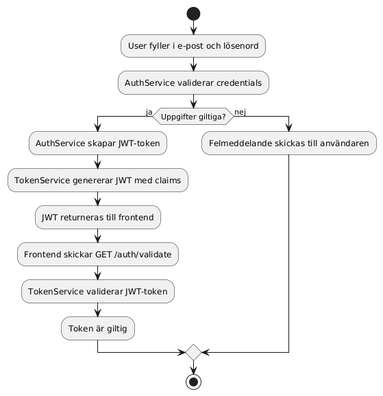
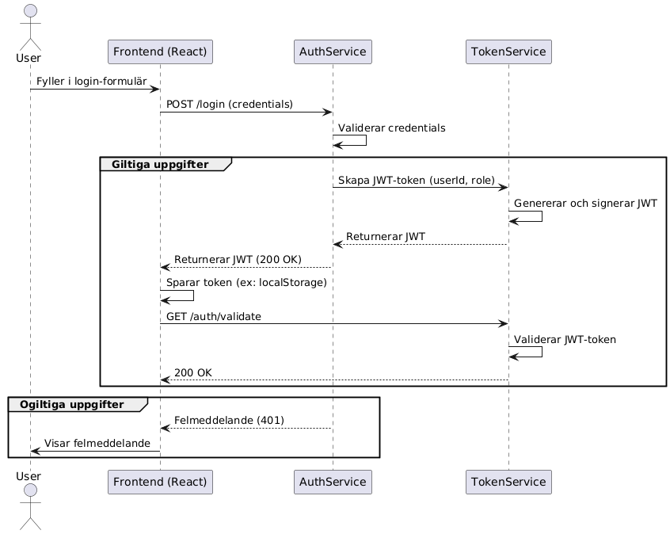

# TokenService 


TokenService är en mikrotjänst som ansvarar för att generera och validera signerade JWT-tokens.  
Den används av andra delar av systemet, t.ex. AuthService, för att autentisera användare i ett distribuerat system.

---

## Funktionalitet

- Genererar JWT-token baserat på `userId` och `role`
- Signerar token med HMAC-SHA256 och en hemlig nyckel
- Validerar JWT-token via endpoint
- Swagger UI aktiveras automatiskt vid start (`/`)

---

## Endpoints

### `POST /auth/token`

Skapar en JWT-token.

#### Request body:
```json
{
  "userId": "alec123",
  "role": "admin"
}
```

### Response:
```json
{
  "token": "eyJhbGciOiJIUzI1NiIsInR5cCI6..."
}
```

### `GET /auth/validate`

Validerar JWT-token via Authorization-header.

#### header:
```makefile
Authorization: Bearer <din-token>
```

### Response:

- `200 OK` → Token är giltig

- `401 Unauthorized` → Token saknas eller ogiltig

- `500 Internal Server Error` → Konfiguration saknas

---

## Kom igång lokalt

1. Klona repositoryt:
```bash
https://github.com/Grupp-4-Ventixe/TokenServiceProvider.git
```
2. Öppna projektet i Visual Studio
3. Kör projektet med `Ctrl + F5`
→ Swagger öppnas automatiskt i webbläsaren (`https://localhost:xxxx/`)

4. Testa endpoints direkt via Swagger UI

---

## Verifiera JWT via jwt.io
1. Generera en token via `/auth/token`
2. Gå till https://jwt.io
3. Klistra in token i vänstra fältet
4. Ange din hemliga nyckel för att verifiera signaturen

---

## Teknologi och beroenden

- ASP.NET Core Web API (.NET 9)
- `System.IdentityModel.Tokens.Jwt`
- `Swashbuckle.AspNetCore` (Swagger)
- `xUnit` för tester

---

## Tester

Täckta scenarier:

- :white_check_mark: Returnerar token-sträng för giltiga värden

- :white_check_mark: Kastar exception om Jwt:Key saknas i konfigurationen

- :white_check_mark: Token innehåller sub, role, issuer, audience

---

## Diagram

### Aktivitetsdiagram



### Sekvensdiagram



---

## Publicering

TokenService är publicerad på Azure:

🔗 [https://tokenservice-hghjfwgwf9cubxdp.swedencentral-01.azurewebsites.net](https://tokenservice-hghjfwgwf9cubxdp.swedencentral-01.azurewebsites.net)

Tjänsten innehåller Swagger UI där du kan testa `/auth/token` och `/auth/validate`.


---

## Författare

Utvecklad av Alec Christensen
